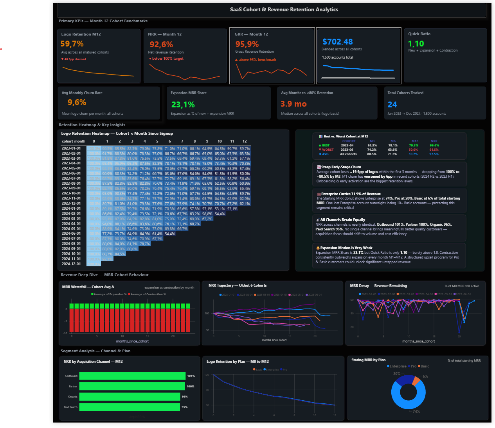
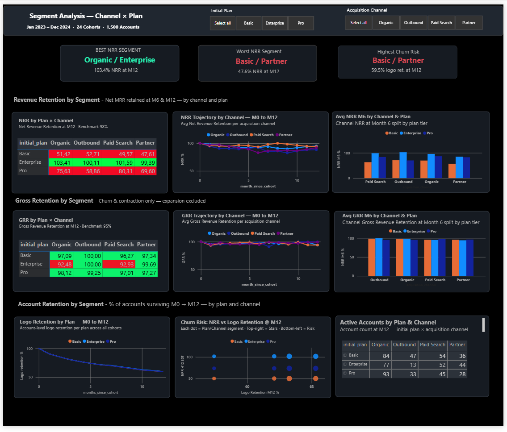
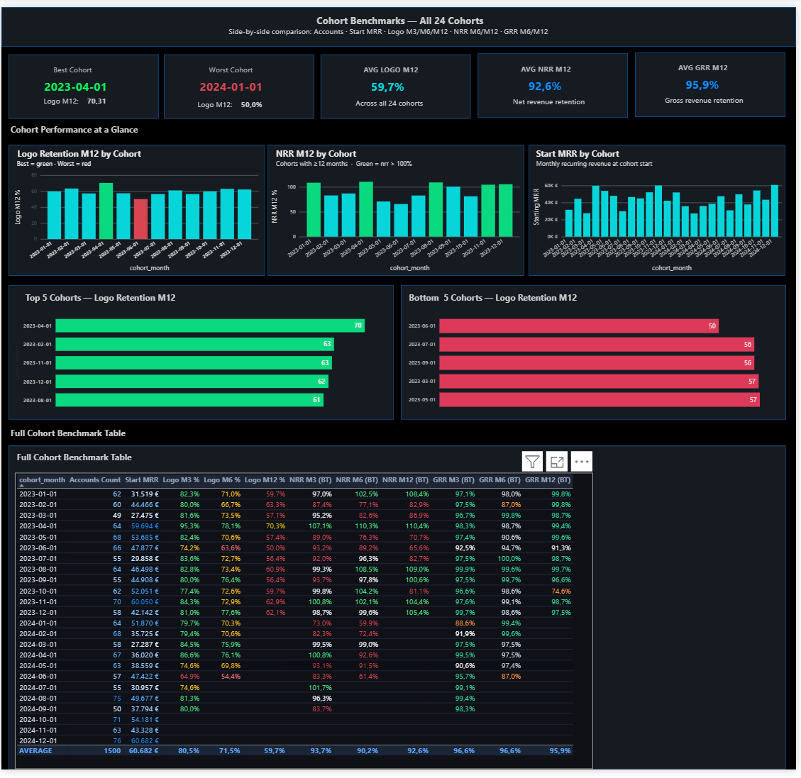

# SaaS Cohort & Revenue Retention Analytics

> **End-to-end portfolio project** · MySQL · Power BI · Cohort Analysis · NRR · GRR · Logo Retention

> ## Table of Contents
- [Project Overview](#project-overview)
- [Business Questions](#business-questions)
- [Key Findings](#key-findings)
- [Tech Stack](#tech-stack)
- [Repository Structure](#repository-structure)
- [Data Model](#data-model)
- [Metric Definitions](#metric-definitions)
- [Power BI Dashboards](#power-bi-dashboards)
- [Business Recommendations](#business-recommendations)
- [How to Reproduce](#how-to-reproduce)
- [Skills Demonstrated](#skills-demonstrated)
- [Author](#author)

***

## Project Overview

A complete SaaS analytics pipeline built from raw subscription data to executive-ready Power BI dashboards. The project tracks **1,500 accounts** across **24 monthly cohorts** (January 2023 – December 2024), computing industry-standard retention metrics — Logo Retention, Net Revenue Retention (NRR), and Gross Revenue Retention (GRR) — at the cohort, segment, and account level.

The goal was to answer a core business question: **Which customers stay, which churn, and where does revenue leak?**

## Business Questions

This project was designed to answer the following analytical questions, structured from strategic to tactical:

### 🔍 Retention & Churn
1. **What percentage of accounts are still active 12 months after signup?** — Is the business retaining customers at a healthy rate?
2. **When does churn happen most — early (M1–M3) or later in the lifecycle?** — Where should onboarding efforts be focused?
3. **Which cohort has the best and worst logo retention at M12?** — Are newer cohorts improving or declining over time?

### 💰 Revenue Retention
4. **Is the business growing net revenue from existing customers (NRR ≥ 100%)?** — Is expansion revenue covering churn losses?
5. **How much revenue is lost purely from churn and contraction (GRR)?** — Are we hitting the ≥95% gross retention benchmark?
6. **How strong is expansion MRR relative to total growth?** — Is the upsell/cross-sell motion contributing meaningfully?

### 📊 Segment Analysis
7. **Which plan tier (Basic / Pro / Enterprise) retains the most revenue?** — Does plan quality correlate with retention?
8. **Which acquisition channel brings the most loyal customers?** — Is outbound or organic more valuable long-term?
9. **Which plan × channel combination is the best and worst performing segment?** — Where should growth investment be focused?

***


***

## Key Findings

| Metric | Value | Benchmark | Status |
|---|---|---|---|
| Avg Logo Retention M12 | 59.7% | ~70% | ⚠️ Below benchmark |
| Avg NRR M12 | 92.6% | ≥100% | ⚠️ Below target |
| Avg GRR M12 | 95.9% | ≥95% | ✅ At benchmark |
| Quick Ratio | 1.10 | >1.0 | ✅ Marginally healthy |
| Avg Monthly Churn Rate | 9.6% | — | High early-stage churn |
| Expansion MRR Share | 23.1% | — | Upsell opportunity |
| Best Cohort | 2023-04-01 | — | 70.3% logo retention M12 |
| Worst Cohort | 2024-01-01 | — | 50.0% logo retention M12 |

**Top insights:**
- Accounts lose ~19.5pp of logos within the first 3 months — steep early-stage churn is the #1 risk
- Enterprise plan drives 74% of starting MRR; one lost Enterprise account equals 10+ Basic accounts
- NRR is nearly identical across all acquisition channels (~95–101%), meaning channel quality is similar — focus should shift to volume and cost efficiency
- Expansion MRR is weak (23.1%); a structured upsell program for Pro and Basic customers could significantly improve NRR
- Organic / Enterprise is the best segment (103.4% NRR M12); Basic / Partner is the worst (47.6% NRR M12)

***

## Tech Stack

| Layer | Tool | Purpose |
|---|---|---|
| Raw Data | CSV files | `accounts.csv`, `account_month_mrr.csv` |
| Data Modeling | MySQL Workbench | SQL views for cohort construction |
| Visualization | Microsoft Power BI | 3 interactive dashboards |
| Metrics | NRR, GRR, Logo Retention, Quick Ratio | standard SaaS KPIs |

***

## Repository Structure

```
saas-cohort-retention-analytics/
│
├── README.md                          
│
├── data/
│   ├── raw/
│   │   ├── accounts.csv               
│   │   └── account_month_mrr.csv      
│   │
│   └── views/                         ← Exported MySQL view outputs (used as Power BI sources)
│       ├── account_cohort_view.csv
│       ├── account_month_with_age_view.csv
│       ├── cohort_logo_retention_view.csv
│       ├── cohort_logo_retention_segmented_view.csv
│       ├── cohort_mrr_retention_view.csv
│       └── cohort_mrr_retention_segmented_view.csv
│
├── sql/
│   ├── 01_account_cohort_view.sql
│   ├── 02_account_month_with_age_view.sql
│   ├── 03_cohort_logo_retention_view.sql
│   ├── 04_cohort_logo_retention_segmented_view.sql
│   ├── 05_cohort_mrr_retention_view.sql
│   └── 06_cohort_mrr_retention_segmented_view.sql
│
├── powerbi/
│   └── saas_cohort_analytics.pbix     ← Power BI report file
│
└── dashboards/
    ├── SaaS_Cohort_Revenue_Retention_Analytics_Overview.png        
    ├── Segment_Analysis_Channel_Plan.png     
    └── Cohort_Benchmarks_All_24_Cohorts.png            
```

***

## Data Model

### Source Tables

**`accounts.csv`** — Account master table
| Column | Type | Description |
|---|---|---|
| `account_id` | VARCHAR | Unique account identifier (e.g., ACC-00001) |
| `signup_date` | DATE | First subscription date |
| `initial_plan` | VARCHAR | Plan at signup: Basic / Pro / Enterprise |
| `acquisition_channel` | VARCHAR | Organic / Outbound / Paid Search / Partner |

**`account_month_mrr.csv`** — Monthly recurring revenue per account
| Column | Type | Description |
|---|---|---|
| `account_id` | VARCHAR | Foreign key to accounts |
| `month` | DATE | Billing month (first of month) |
| `mrr` | DECIMAL | Monthly recurring revenue in EUR |

### SQL Views (MySQL Workbench)

Six views were built progressively, each feeding the next layer of analysis:

```
accounts + account_month_mrr
        │
        ▼
[1] account_cohort_view          → Assigns each account to its cohort month
        │
        ▼
[2] account_month_with_age_view  → Adds months_since_cohort to every MRR row
        │
        ├──▶ [3] cohort_logo_retention_view           → Logo retention % by cohort & month
        ├──▶ [4] cohort_logo_retention_segmented_view → Logo retention split by plan × channel
        ├──▶ [5] cohort_mrr_retention_view            → NRR & GRR by cohort & month
        └──▶ [6] cohort_mrr_retention_segmented_view  → NRR & GRR split by plan × channel
```

#### View Schemas

**`account_cohort_view`**
```sql
account_id | cohort_month | signup_date
```
Assigns each account's cohort month as the first day of their signup month.

**`account_month_with_age_view`**
```sql
account_id | cohort_month | month | months_since_cohort
```
Joins MRR history to cohort assignments and calculates age in months since cohort start.

**`cohort_logo_retention_view`**
```sql
cohort_month | months_since_cohort | accounts_in_cohort | active_accounts | logo_retention_rate_pct
```
Aggregates active account counts per cohort per month to calculate logo (account) retention.

**`cohort_logo_retention_segmented_view`**
```sql
cohort_month | months_since_cohort | initial_plan | acquisition_channel | accounts_in_cohort | active_accounts | logo_retention_rate_pct
```
Same as above, broken down by plan and acquisition channel for segment analysis.

**`cohort_mrr_retention_view`**
```sql
cohort_month | months_since_cohort | start_mrr | cohort_mrr | grr | nrr
```
Computes GRR (churn + contraction only) and NRR (including expansion) per cohort per month, expressed as a ratio against starting MRR.

**`cohort_mrr_retention_segmented_view`**
```sql
cohort_month | months_since_cohort | initial_plan | acquisition_channel | start_mrr | cohort_mrr | grr | nrr
```
NRR and GRR split by plan and acquisition channel.

***

## Metric Definitions

| Metric | Formula | Interpretation |
|---|---|---|
| **Logo Retention** | Active accounts at M_n ÷ Accounts at M0 | % of accounts still subscribed at month N |
| **GRR** | (Starting MRR − churned MRR − contracted MRR) ÷ Starting MRR | Revenue retained excluding expansion; max = 100% |
| **NRR** | (Starting MRR − churned − contracted + expanded MRR) ÷ Starting MRR | Revenue retained including upsells; can exceed 100% |
| **Quick Ratio** | (New MRR + Expansion MRR) ÷ (Churned MRR + Contraction MRR) | Growth efficiency; >1 means growing |
| **Expansion MRR Share** | Expansion MRR ÷ (New + Expansion MRR) | How much growth comes from existing customers |

***

## Power BI Dashboards

### Dashboard 1 - SaaS_Cohort_Revenue_Retention_Analytics_Overview

The main executive summary dashboard. Shows all primary KPIs (Logo Retention M12, NRR M12, GRR M12, Quick Ratio, Blended MRR), a full cohort heatmap (cohort × months since signup), MRR waterfall, NRR trajectory for oldest cohorts, MRR decay curves, and a segment summary by channel and plan.



***

### Dashboard 2 — Segment Analysis (Channel × Plan)

Side-by-side comparison of all 24 cohorts. Includes KPI cards for best/worst cohort and portfolio averages, bar charts for Logo Retention M12, NRR M12, and Start MRR by cohort, ranked Top 5 / Bottom 5 cohort tables, and the full benchmark data table with M3/M6/M12 metrics.


***

### Dashboard 3 — Cohort Benchmarks (All 24 Cohorts) 

Drill-down into the 12 plan × channel segments (3 plans × 4 channels). Includes NRR and GRR matrix tables, trajectory line charts M0 → M12, grouped bar charts at M6, logo retention curves, a churn-risk scatter plot (NRR vs logo retention), and active account counts at M12. Filterable by Initial Plan and Acquisition Channel slicers.


***

***

## 💡 Business Recommendations

| # | Area | Finding | Recommendation |
|---|---|---|---|
| 1 | 🚨 Onboarding | ~19.5pp logo loss in M1–M3 — steepest churn window | Introduce structured onboarding with activation milestones and 30-day proactive check-ins |
| 2 | 🏢 Enterprise Retention | Enterprise = 74% of MRR; 1 lost account ≈ 10+ Basic accounts | Assign dedicated CSMs, quarterly business reviews, and 90-day renewal workflows |
| 3 | 📈 Upsell / Expansion | Expansion MRR Share only 23.1%; Quick Ratio barely at 1.10 | Build upgrade prompts at 80% plan usage limits; target Basic → Pro conversion |
| 4 | ⚠️ Basic / Partner Segment | NRR 47.6% — worst segment by far | Evaluate CAC vs. LTV; restrict or restructure Basic plan on the Partner channel |
| 5 | 📣 Channel Strategy | NRR nearly identical across all channels (95–101%) | Stop optimizing by channel quality; shift focus to CAC efficiency and volume |
| 6 | 📉 Cohort Trend | Best cohort 2023-04 (70.3%); worst 2024-01 (50.0%) — declining trend | Alert when M3 retention drops below 75%; investigate 2024 cohort quality drivers |

## How to Reproduce

### Step 1 — Load Raw Data into MySQL

```sql
-- Create database
CREATE DATABASE saas_analytics;
USE saas_analytics;

-- Import tables
-- accounts: account_id, signup_date, initial_plan, acquisition_channel
-- account_month_mrr: account_id, month, mrr
```

### Step 2 — Run SQL Views in Order

Execute the `.sql` files from the `sql/` folder **in numerical order** (01 → 06).
Each view depends on the previous ones.

```bash
# Run in MySQL Workbench or via CLI
mysql -u root -p saas_analytics < sql/01_account_cohort_view.sql
mysql -u root -p saas_analytics < sql/02_account_month_with_age_view.sql
# ... continue through 06
```

### Step 3 — Export Views to CSV

Export each view as a `.csv` file into the `data/views/` folder. These CSV files serve as the data source for Power BI.

### Step 4 — Open Power BI Report

1. Open `powerbi/saas_cohort_analytics.pbix` in Power BI Desktop
2. Update the data source path to point to your local `data/views/` folder
3. Click **Refresh** to reload all data
4. All visuals and DAX measures will recalculate automatically

***

## Skills Demonstrated

- **SQL** — Window functions, CTEs, `DATEDIFF`, `DATE_FORMAT`, aggregation, multi-step view chaining
- **Data Modeling** — Incremental view architecture; separating raw data from analytical layers
- **SaaS Metrics** — NRR, GRR, Logo Retention, Quick Ratio, Expansion MRR — computed from scratch
- **Power BI** — Multi-page dashboards, DAX measures, conditional formatting, slicers, heatmaps
- **Analytical Thinking** — Cohort segmentation, best/worst cohort identification, churn risk profiling
- **Data Storytelling** — Translating retention data into actionable business insights

***

## Author

**Md Shafayet Hossen Chowdhury**
M.Sc. in Data Science · Data Analyst Enthusiast · SQL · Power BI 
📍 Potsdam, Germany  
🔗 [LinkedIn](https://www.linkedin.com/in/mdshafayet/)

***
